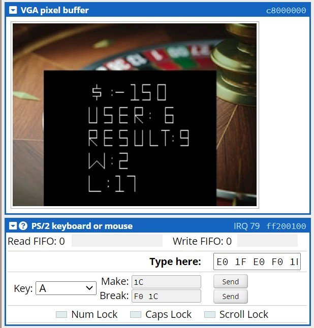

# Roulette-DE1SoC
A C program to play roulette for the DE1SoC board that lets the user input a number via the PS/2 keyboard. Then, the result of the roulette wheel, the user input, total wins/losses and the winnings are displayed on the VGA pixel buffer.

## Background

A fixed amount of $10 is bet for each round of the game. The user enters a digit from 0-9 on the PS/2 keyboard of the Altera DE1-SoC board. This number is passed to a random number generator written in C that returns a single digit number. If the user's input and the number gerated randomly matches, then the user has won or else they have lost. The number of wins, losses, the user input, the roulette wheel number and the total winnings/losses of the user are displayed on the VGA screen. 



## Running the program

1. Open ```cpulator.01xz.net``` on your favorite browser.
2. Select the architecture as ```ARMv7``` and the system as ```ARMv7 DE-1 SoC```.
3. Change the language to ```C```.
4. Download the ```Source.c``` file from here and upload it to cpulator. 
5. Hit the compile button.
6. Drag and place the PS/2 keyboard with address ```ff200100``` next to the VGA Pixel buffer for ease of use. 
7. Keep entering numbers on the keyboard and the display will update automatically
